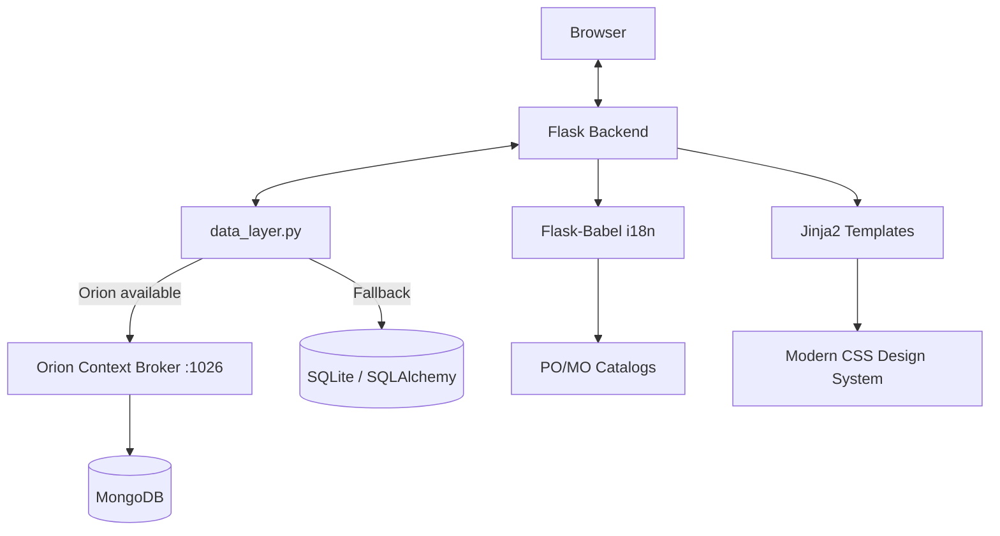

# Architecture - FIWARE Smart Store

## Component Overview
The application follows a standard Flask MVC-like pattern, enhanced with internationalization and an optional FIWARE Orion Context Broker integration.

> **Note**: Orion Context Broker and MongoDB are optional components. When not available, all data operations fall through to the local SQLite database with no change in application behaviour.

## Layers
- **Frontend**:
    - **Templates**: Semantic HTML5 using Jinja2 with a modern component-based layout (`base.html`).
    - **Styles**: Custom CSS design system in `static/css/style.css`.
    - **Interactive Elements**: Maps integration and dynamic stock management.
- **Backend**:
    - **Business Logic**: `app.py` handles routing, model definitions, and CRUD operations using SQLAlchemy ORM.
    - **Data Abstraction**: `data_layer.py` centralises all CRUD for Store, Product, and Employee. On startup it probes Orion; if reachable it routes all operations to Orion via NGSIv2 REST API, otherwise falls back to SQLite.
    - **Database (default)**: SQLite via SQLAlchemy for persistent local storage.
- **FIWARE Integration (optional)**:
    - **Orion Context Broker**: NGSIv2-compliant context broker. Runs in Docker (`docker-compose.yml`).
    - **MongoDB**: Orion's backing store. Managed by Docker Compose.
- **Data Model**:
    - **Entities**: Store, Product, Employee, Inventory, Shelf.
    - **NGSIv2 Mapping**: Store, Product, and Employee are mapped to NGSI entities with URN IDs (`urn:ngsi-ld:<Type>:<NNN>`). See `data_model.md` for full mapping.
- **Internationalization**:
    - **Logic**: Flask-Babel with `.po` catalogs.
    - **Persistence**: Language selection via URL (`?lang=`) and session management.

## Project Structure
- `app.py`: Main application logic, model definitions, and CRUD routes.
- `data_layer.py`: Data abstraction layer. Detects Orion availability and routes CRUD to Orion or SQLite.
- `docker-compose.yml`: Docker Compose configuration for Orion Context Broker and MongoDB (from FIWARE CRUD-Operations tutorial).
- `.env`: Environment variables for `docker-compose.yml` (Orion/MongoDB versions and ports).
- `start.sh`: Script to start Docker services + Flask application.
- `stop.sh`: Script to stop the Flask application and Docker services.
- `translations/`: Compiled and source translation files for `es` and `en`.
- `templates/`:
    - `base.html`: Common layout and navigation.
    - `dashboard.html`: Statistics and overview.
    - `stores.html` & `products.html`: List views.
    - `store_detail.html`, `product_detail.html` & `employee_detail.html`: Full attribute display.
    - `store_form.html`, `product_form.html` & `employee_form.html`: CRUD forms.
- `static/css/style.css`: Modern, responsive design system.
- `dummy_translations.py`: Helper for dynamic string extraction.
