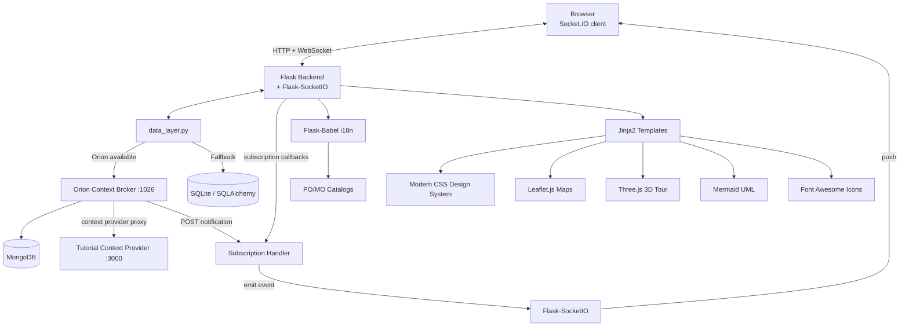

# Architecture - FIWARE Smart Store (Práctica 2)

## Component Overview
The application follows a Flask MVC-like pattern, enhanced with internationalization, FIWARE Orion Context Broker integration, real-time WebSocket notifications, and a rich frontend powered by Leaflet, Three.js, and Mermaid.

> **Note**: Orion Context Broker, MongoDB, and the Tutorial Context Provider are Docker-managed components. When Orion is not available, all data operations fall through to the local SQLite database. Context-provided attributes (temperature, relativeHumidity, tweets) are only available when Orion + the context provider are running.

## Layers

- **Frontend**:
    - **Templates**: Semantic HTML5 using Jinja2 with a component-based layout (`base.html`).
    - **Styles**: Custom CSS design system in `static/css/style.css` with dark/light mode toggle.
    - **Interactive Elements**: Leaflet.js maps, Three.js 3D store walkthrough, Mermaid UML diagram on Home Dashboard and Architecture pages.
    - **Icons**: Font Awesome icon set throughout the UI.
    - **Real-Time**: Socket.IO JS client receives push notifications from backend.
    - **i18n**: ES/EN language switch via URL parameter and session.
- **Backend**:
    - **Business Logic**: `app.py` handles routing, model definitions, and CRUD operations using SQLAlchemy ORM.
    - **Data Abstraction**: `data_layer.py` centralises all CRUD for Store, Product, and Employee. On startup it probes Orion; if reachable it routes all operations to Orion via NGSIv2 REST API, otherwise falls back to SQLite. It also provides a dedicated proxy endpoint (`POST /api/inventory/purchase`) logic handler to intercept and decrement stock, circumventing Orion CORS constraints and securing direct database access.
    - **Database (default)**: SQLite via SQLAlchemy for persistent local storage.
    - **WebSocket**: Flask-SocketIO serves real-time events to connected browsers.
    - **Subscription Handler**: HTTP endpoint(s) that receive Orion subscription notifications (price change, low stock) and re-emit them as SocketIO events.
- **FIWARE Integration**:
    - **Orion Context Broker**: NGSIv2-compliant context broker. Runs in Docker (`docker-compose.yml`).
    - **MongoDB**: Orion's backing store. Managed by Docker Compose.
    - **Context Provider** (tutorial container): Provides `temperature`, `relativeHumidity`, and `tweets` attributes for Store entities. Registered in Orion at app startup.
    - **Subscriptions**: Two NGSIv2 subscriptions created at startup:
      1. **Price change** — watches `price` on `Product` entities. URL: `/subscriptions/price-change`
      2. **Low stock** — watches `shelfCount` on `InventoryItem` entities. URL: `/subscriptions/low-stock`
    - Notification URL uses `host.docker.internal` so containerised Orion can reach the host Flask app.
- **Data Model**:
    - **Entities**: Store, Product, Employee, Inventory, Shelf.
    - **NGSIv2 Mapping**: Store, Product, and Employee are mapped to NGSI entities with URN IDs (`urn:ngsi-ld:<Type>:<NNN>`). See `data_model.md` for full mapping.
- **Internationalization**:
    - **Logic**: Flask-Babel with `.po` catalogs.
    - **Persistence**: Language selection via URL (`?lang=`) and session management.

## Project Structure
- `app.py`: Main application logic, model definitions, CRUD routes, subscription callback endpoints, and SocketIO event emitters.
- `data_layer.py`: Data abstraction layer. Detects Orion availability and routes CRUD to Orion or SQLite.
- `docker-compose.yml`: Docker Compose configuration for Orion Context Broker, MongoDB, and the tutorial context-provider container.
- `.env`: Environment variables for `docker-compose.yml` (Orion/MongoDB versions and ports).
- `import-data.sh`: Shell script to provision Orion with seed data (4 stores, 4 employees, 4 shelves/store, 10 products, ≥4 products/shelf).
- `start.sh`: Script to start Docker services + Flask application. Now includes a wait loop for the `tutorial` context-provider service to ensure context data stability.
- `stop.sh`: Script to stop the Flask application and Docker services.
- `translations/`: Compiled and source translation files for `es` and `en`.
- `templates/`:
    - `base.html`: Common layout, navigation, dark/light toggle, and Socket.IO client.
    - `dashboard.html`: Statistics, overview, and Mermaid UML diagram.
    - `stores.html` & `products.html`: List views.
    - `store_detail.html`: Full attribute display, Leaflet map, Three.js 3D tour.
    - `product_detail.html` & `employee_detail.html`: Full attribute display.
    - `store_form.html`, `product_form.html` & `employee_form.html`: CRUD forms.
- `static/css/style.css`: Modern, responsive design system with dark/light themes.
- `static/img/products/`: AI-generated product images (`.png`, excluded from version control via `.gitignore`).
- `static/img/stores/`: AI-generated store facade images (`.png`, excluded from version control via `.gitignore`).
- `static/js/`: Client-side JavaScript (Socket.IO handler, Three.js scene, Mermaid init, etc.).
- `dummy_translations.py`: Helper for dynamic string extraction.

### Real-time DOM Constraints
- Notifications for 'price_change' and 'low_stock' populate pre-staged DOM elements (e.g., hidden slots) ensuring strict adherence to avoiding HTML document structure modification via JavaScript.
- Socket.io integrated for real time prices and low stock.
- Offline mode explicitly degrades to "Sin datos".

### Visual Refinements (UI/UX)
- Improved user feedback visually replacing pure text arrays or descriptions with `font-awesome` icons (Skills, Roles) and mapping Flags to countries.
- Improved Employee and Store image feedback interactions with `hover` zoom, transform, and map interactions.
- Standalone `Stores Map` tab added providing dynamic Leaflet map UI displaying all stores simultaneously.
