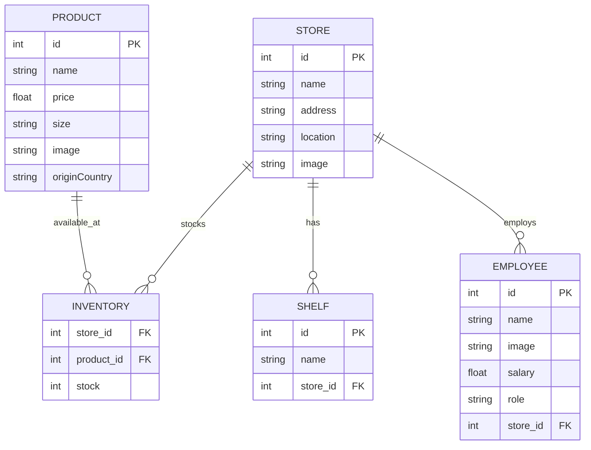

# Data Model - FIWARE Smart Store

## Entity Relationship Diagram



## Tables Detail

### Store
Represents a physical retail location.
- `id` (Integer, Primary Key)
- `name` (String, Required): e.g., "Store Alpha".
- `address` (String): e.g., "Friedrichstraße 44, 10969 Berlin".
- `location` (String): GPS coordinates in "lat, lng" format, e.g., "52.5075, 13.3903". Used for map rendering.
- `image` (String): URL to an image of the store.

### Product
Items available for sale across the chain.
- `id` (Integer, Primary Key)
- `name` (String, Required): e.g., "Leche".
- `price` (Float, Required): Base price of the product.
- `size` (String): e.g., "1L", "500g".
- `image` (String): URL or relative path (e.g., `/static/img/products/leche.png`) to an image of the product.
- `originCountry` (String): ISO country code, e.g., "ES".

### Inventory
Specific stock levels linking products to stores.
- `store_id` (Integer, Foreign Key to Store)
- `product_id` (Integer, Foreign Key to Product)
- `stock` (Integer, Default: 0): Current number of items in the store.

### Shelf
Storage units within a store.
- `id` (Integer, Primary Key)
- `name` (String, Required): e.g., "Shelf 1".
- `store_id` (Integer, Foreign Key to Store)

> [!NOTE]
> All entity images (Store, Product, Employee) are processed through a standardized CSS system that ensures consistent aspect ratios and visual quality across all views.
### Employee
Represents staff members assigned to a store.
- `id` (Integer, Primary Key)
- `name` (String, Required): e.g., "John Doe".
- `image` (String): URL to the employee's photo.
- `salary` (Float): Annual or monthly salary.
- `role` (String): e.g., "Manager", "Cashier".
- `store_id` (Integer, Foreign Key to Store): Links the employee to their workplace.

## Initial Seed Data
The database is initialized with 4 stores and 10 products:
- **Products**: Leche (ES), Pan (FR), Huevos (ES), Arroz (IT), Pasta (IT), Manzanas (ES), Plátanos (EC), Pollo (ES), Ternera (AR), Agua (ES). Each with specific `size`, `price`, and `image` (local paths are used for Leche, Manzanas, and Ternera to ensure availability).
- **Stores**:
    - **Store Alpha**: Friedrichstraße 44, Berlin. Includes products 1-5 and assigned employees.
    - **Store Beta**: Gran Vía 1, Madrid. Includes products 6-10 and assigned employees.
    - **Store Gamma**: Corso Vittorio Emanuele II, Torino. Includes products 1, 3, 5, 7, 10 and assigned employees.
    - **Store Delta**: Champs-Élysées, Paris. Includes products 2, 4, 6, 8, 9 and assigned employees.
- **Employees**: Sample employees (e.g., "Alice Smith", "Bob Jones") are assigned across stores with roles like `Manager`, `Cashier`, and `Stock Clerk`.

---

## NGSIv2 Entity Mapping

When the application uses Orion Context Broker as its data source, entities are mapped to the [NGSIv2](https://fiware.github.io/specifications/ngsiv2/stable/) standard. Entity IDs follow the URN convention: `urn:ngsi-ld:<Type>:<NNN>` (3-digit zero-padded integer).

### Store → NGSIv2

The `location` field (stored as `"lat, lng"` in SQLite) is converted to a GeoJSON `Point` with coordinates `[lng, lat]`.

```json
{
  "id": "urn:ngsi-ld:Store:001",
  "type": "Store",
  "name":     { "type": "Text",     "value": "Tienda Centro" },
  "address":  { "type": "Text",     "value": "Calle Mayor 1" },
  "location": {
    "type": "geo:json",
    "value": { "type": "Point", "coordinates": [-3.70325, 40.4167] }
  },
  "image": { "type": "Text", "value": "https://example.com/store.jpg" }
}
```

### Product → NGSIv2

The `price` attribute is stored as a numeric `Number` type. The `size` field (only present in SQLite) is not part of the NGSIv2 mapping.

```json
{
  "id": "urn:ngsi-ld:Product:001",
  "type": "Product",
  "name":          { "type": "Text",   "value": "Leche" },
  "price":         { "type": "Number", "value": 1.25 },
  "originCountry": { "type": "Text",   "value": "España" },
  "image":         { "type": "Text",   "value": "https://example.com/leche.jpg" }
}
```

### Employee → NGSIv2

The `salary` field is stored as `Number`. The `refStore` attribute holds a reference to the associated Store entity using its full URN.

```json
{
  "id": "urn:ngsi-ld:Employee:001",
  "type": "Employee",
  "name":     { "type": "Text",      "value": "Juan García" },
  "salary":   { "type": "Number",    "value": 1800 },
  "role":     { "type": "Text",      "value": "Manager" },
  "refStore": { "type": "Reference", "value": "urn:ngsi-ld:Store:001" },
  "image":    { "type": "Text",      "value": "https://example.com/juan.jpg" }
}
```

### Mapping Summary

| App field       | NGSIv2 attribute | NGSIv2 type  | Notes |
|-----------------|------------------|--------------|-------|
| `Store.name`    | `name`           | `Text`       | |
| `Store.address` | `address`        | `Text`       | |
| `Store.location`| `location`       | `geo:json`   | Converted from `"lat,lng"` to GeoJSON Point `[lng, lat]` |
| `Store.image`   | `image`          | `Text`       | |
| `Product.name`  | `name`           | `Text`       | |
| `Product.price` | `price`          | `Number`     | |
| `Product.originCountry` | `originCountry` | `Text` | |
| `Product.image` | `image`          | `Text`       | |
| `Employee.name` | `name`           | `Text`       | |
| `Employee.salary`| `salary`        | `Number`     | |
| `Employee.role` | `role`           | `Text`       | |
| `Employee.store_id` | `refStore`  | `Reference`  | Value: `urn:ngsi-ld:Store:<NNN>` |
| `Employee.image`| `image`          | `Text`       | |
