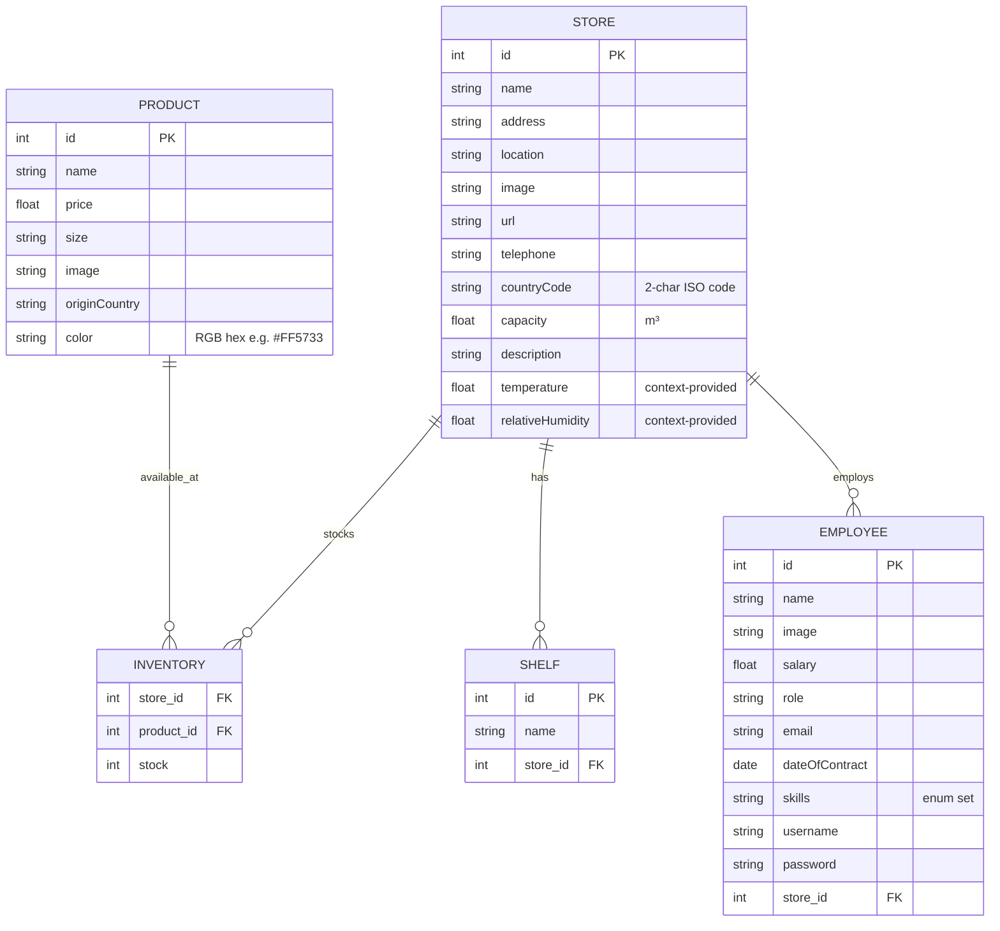

# Data Model - FIWARE Smart Store (Práctica 2)

## Entity Relationship Diagram



## Tables Detail

### Store
Represents a physical retail location.
- `id` (Integer, Primary Key)
- `name` (String, Required): e.g., "Store Alpha".
- `address` (String): e.g., "Friedrichstraße 44, 10969 Berlin".
- `location` (String): GPS coordinates in "lat, lng" format, e.g., "52.5075, 13.3903". Used for Leaflet map rendering.
- `image` (String): URL to an image of the store.
- `url` (String): Web URL of the store, e.g., "https://store-alpha.example.com".
- `telephone` (String): Contact phone number, e.g., "+49 30 12345678".
- `countryCode` (String, 2 chars): ISO 3166-1 alpha-2 country code, e.g., "DE".
- `capacity` (Float): Storage capacity in cubic metres (m³).
- `description` (Text): Free-text description of the store.
- `temperature` (Float, **context-provided**): Current ambient temperature. Not persisted locally; served by the FIWARE tutorial context-provider container via Orion.
- `relativeHumidity` (Float, **context-provided**): Current relative humidity (%). Not persisted locally; served by the FIWARE tutorial context-provider container via Orion.

> [!NOTE]
> `temperature` and `relativeHumidity` are **not stored** in SQLite or Orion. They are supplied on-the-fly by the external context provider registered in Orion at application startup.

### Product
Items available for sale across the chain.
- `id` (Integer, Primary Key)
- `name` (String, Required): e.g., "Leche".
- `price` (Float, Required): Base price of the product.
- `size` (String): e.g., "1L", "500g".
- `image` (String): URL or relative path (e.g., `/static/img/products/leche.png`) to an image of the product.
- `originCountry` (String): ISO country code, e.g., "ES".
- `color` (String): RGB hex color code, e.g., "#FF5733". Stored as `Text` in both SQLite and NGSIv2.

### Inventory
Specific stock levels linking products to stores.
- `store_id` (Integer, Foreign Key to Store)
- `product_id` (Integer, Foreign Key to Product)
- `stock` (Integer, Default: 0): Current number of items in the store.

### Shelf
Storage units within a store.
- `id` (Integer, Primary Key)
- `name` (String, Required): e.g., "Shelf 1".
- `store_id` (Integer, Foreign Key to Store)

> [!NOTE]
> All entity images (Store, Product, Employee) are processed through a standardised CSS system that ensures consistent aspect ratios and visual quality across all views.

### Employee
Represents staff members assigned to a store. Each employee belongs to exactly **one** Store.
- `id` (Integer, Primary Key)
- `name` (String, Required): e.g., "John Doe".
- `image` (String): URL to the employee's photo.
- `salary` (Float): Annual or monthly salary.
- `role` (String): e.g., "Manager", "Cashier".
- `email` (String): e.g., "john.doe@smartstore.com".
- `dateOfContract` (Date): Employment start date, e.g., "2024-03-15".
- `skills` (String / List): One or more values from the enum set:
  - `MachineryDriving`
  - `WritingReports`
  - `CustomerRelationships`
- `username` (String): Login username.
- `password` (String): Login password (stored hashed in production).
- `store_id` (Integer, Foreign Key to Store): Links the employee to their workplace.

## Initial Seed Data

The system is provisioned via the **`import-data.sh`** script with the following volumes:

| Entity | Count | Detail |
|---|---|---|
| Stores | 4 | Each with unique location, countryCode, capacity, etc. |
| Employees | 4 | Distributed across stores |
| Shelves | 16 | 4 shelves per store |
| Products | 10 | Each with color, size, price, and origin |
| Products / Shelf | ≥ 4 | At least 4 products assigned to every shelf |

- **Products**: Leche (ES), Pan (FR), Huevos (ES), Arroz (IT), Pasta (IT), Manzanas (ES), Plátanos (EC), Pollo (ES), Ternera (AR), Agua (ES). Each with specific `size`, `price`, `color`, and `image`.
- **Stores**:
    - **Store Alpha**: Friedrichstraße 44, Berlin (DE). Includes products 1-5 and assigned employees.
    - **Store Beta**: Gran Vía 1, Madrid (ES). Includes products 6-10 and assigned employees.
    - **Store Gamma**: Corso Vittorio Emanuele II, Torino (IT). Includes products 1, 3, 5, 7, 10 and assigned employees.
    - **Store Delta**: Champs-Élysées, Paris (FR). Includes products 2, 4, 6, 8, 9 and assigned employees.
- **Employees**: 4 employees (e.g., "Alice Smith", "Bob Jones") assigned across stores with roles like `Manager`, `Cashier`, and `Stock Clerk`, each with email, dateOfContract, skills, username, and password.

---

## NGSIv2 Entity Mapping

When the application uses Orion Context Broker as its data source, entities are mapped to the [NGSIv2](https://fiware.github.io/specifications/ngsiv2/stable/) standard. Entity IDs follow the URN convention: `urn:ngsi-ld:<Type>:<NNN>` (3-digit zero-padded integer).

### Store → NGSIv2

The `location` field (stored as `"lat, lng"` in SQLite) is converted to a GeoJSON `Point` with coordinates `[lng, lat]`. The `temperature` and `relativeHumidity` attributes are **not** stored in Orion — they are provided by an external context provider.

```json
{
  "id": "urn:ngsi-ld:Store:001",
  "type": "Store",
  "name":             { "type": "Text",     "value": "Tienda Centro" },
  "address":          { "type": "Text",     "value": "Calle Mayor 1" },
  "location": {
    "type": "geo:json",
    "value": { "type": "Point", "coordinates": [-3.70325, 40.4167] }
  },
  "image":            { "type": "Text",     "value": "https://example.com/store.jpg" },
  "url":              { "type": "Text",     "value": "https://store-centro.example.com" },
  "telephone":        { "type": "Text",     "value": "+34 91 1234567" },
  "countryCode":      { "type": "Text",     "value": "ES" },
  "capacity":         { "type": "Number",   "value": 250.0 },
  "description":      { "type": "Text",     "value": "Flagship downtown store" }
}
```

> [!IMPORTANT]
> `temperature`, `relativeHumidity`, and `tweets` for Store entities are served by an external context provider registered at startup. When querying Orion with `?options=keyValues` these attributes are transparently merged into the response.

### Product → NGSIv2

```json
{
  "id": "urn:ngsi-ld:Product:001",
  "type": "Product",
  "name":          { "type": "Text",   "value": "Leche" },
  "price":         { "type": "Number", "value": 1.25 },
  "size":          { "type": "Text",   "value": "1L" },
  "originCountry": { "type": "Text",   "value": "ES" },
  "image":         { "type": "Text",   "value": "https://example.com/leche.jpg" },
  "color":         { "type": "Text",   "value": "#FFFFFF" }
}
```

### Employee → NGSIv2

```json
{
  "id": "urn:ngsi-ld:Employee:001",
  "type": "Employee",
  "name":           { "type": "Text",      "value": "Juan García" },
  "salary":         { "type": "Number",    "value": 1800 },
  "role":           { "type": "Text",      "value": "Manager" },
  "email":          { "type": "Text",      "value": "juan.garcia@smartstore.com" },
  "dateOfContract": { "type": "DateTime",  "value": "2023-06-01T00:00:00.000Z" },
  "skills":         { "type": "StructuredValue", "value": ["MachineryDriving", "WritingReports"] },
  "username":       { "type": "Text",      "value": "jgarcia" },
  "password":       { "type": "Text",      "value": "hashed_password_here" },
  "refStore":       { "type": "Relationship", "value": "urn:ngsi-ld:Store:001" },
  "image":          { "type": "Text",      "value": "https://example.com/juan.jpg" }
}
```

### Mapping Summary

| App field | NGSIv2 attribute | NGSIv2 type | Notes |
|---|---|---|---|
| `Store.name` | `name` | `Text` | |
| `Store.address` | `address` | `Text` | |
| `Store.location` | `location` | `geo:json` | Converted from `"lat,lng"` to GeoJSON Point `[lng, lat]` |
| `Store.image` | `image` | `Text` | |
| `Store.url` | `url` | `Text` | |
| `Store.telephone` | `telephone` | `Text` | |
| `Store.countryCode` | `countryCode` | `Text` | 2-char ISO 3166-1 alpha-2 |
| `Store.capacity` | `capacity` | `Number` | Cubic metres (m³) |
| `Store.description` | `description` | `Text` | |
| `Store.temperature` | `temperature` | `Number` | **Context-provided** — not stored in Orion |
| `Store.relativeHumidity` | `relativeHumidity` | `Number` | **Context-provided** — not stored in Orion |
| `Store.tweets` | `tweets` | `StructuredValue` | **Context-provided** — not stored in Orion |
| `Product.name` | `name` | `Text` | |
| `Product.price` | `price` | `Number` | |
| `Product.size` | `size` | `Text` | |
| `Product.originCountry` | `originCountry` | `Text` | |
| `Product.image` | `image` | `Text` | |
| `Product.color` | `color` | `Text` | RGB hex string, e.g. `#FF5733` |
| `Employee.name` | `name` | `Text` | |
| `Employee.salary` | `salary` | `Number` | |
| `Employee.role` | `role` | `Text` | |
| `Employee.email` | `email` | `Text` | |
| `Employee.dateOfContract` | `dateOfContract` | `DateTime` | ISO 8601 format |
| `Employee.skills` | `skills` | `StructuredValue` | Array of enum strings |
| `Employee.username` | `username` | `Text` | |
| `Employee.password` | `password` | `Text` | Hashed in production |
| `Employee.store_id` | `refStore` | `Relationship` | Value: `urn:ngsi-ld:Store:<NNN>` |
| `Employee.image` | `image` | `Text` | |

### Context Provider Registration

At startup the application registers the tutorial context provider in Orion for:

```json
{
  "url": "http://context-provider:3000/random/weatherConditions",
  "attrs": ["temperature", "relativeHumidity"],
  "providingApplication": "http://context-provider:3000"
}
```

```json
{
  "url": "http://context-provider:3000/random/tweets",
  "attrs": ["tweets"],
  "providingApplication": "http://context-provider:3000"
}
```

### Subscription Definitions

| # | Description | Entity type | Watched attrs | Notification URL |
|---|---|---|---|---|
| 1 | Price change | `Product` | `price` | `http://host.docker.internal:5000/subscriptions/price-change` |
| 2 | Low stock | `InventoryItem` | `shelfCount` | `http://host.docker.internal:5000/subscriptions/low-stock` |

> [!IMPORTANT]
> `host.docker.internal` is used instead of `localhost` because Orion runs inside a Docker container and needs to reach the Flask app on the host machine.
